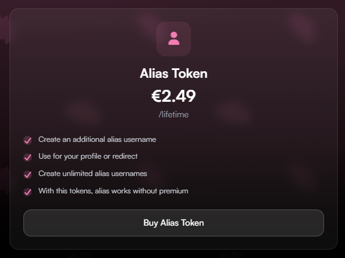
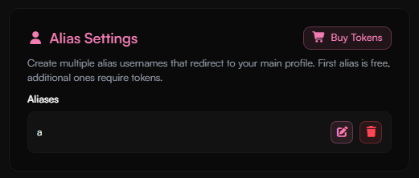

## Available Products

<Tabs>
  <Tab title="Premium" icon="star">
    <Frame>
      
    </Frame>

    View all Premium features in this [documentation](../guides/premium).
  </Tab>

  <Tab title="Image Host" icon="image">
    <Frame>
      
    </Frame>

    The Image Host product only increases limits — our imagehost in general is free to use.  
    Check out the [documentation](../guides/imagehost) for more details.
  </Tab>

  <Tab title="Custom Badge" icon="icons">
    <Frame>
      
    </Frame>

    The Custom Badge lets you create your own badge with a custom name and icon.  

    Impersonating official **haunt.gg** badges is not permitted.  
    Using inappropriate names or icons is strictly forbidden and may result in a ban.  
    Refunds will not be provided in such cases.

    ### Custom Badge Tokens

<Frame caption="If you buy the Custom Badge product, you will receive Custom Badge Tokens. Each token represents one custom badge.">
  
</Frame>

  </Tab>

  <Tab title="Donator" icon="circle-dollar">
    <Frame caption="The Donator badge is a way to show your support for our service and development. It has no functional benefits.">
      
    </Frame>
  </Tab>

  <Tab title="Verified" icon="badge-check">
    <Frame caption="Verified allows you to create 2 character usernames.">
      
    </Frame>

    The Verified badge is ideal for content creators.  
    If you have over **10,000 followers** on any social media platform, you can apply for verification.  
    Read more in the [Verified documentation](../guides/verification).
  </Tab>

  <Tab title="Donator" icon="circle-dollar">
    <Frame caption="The Donator badge is a way to show your support for our service and development. It has no functional benefits.">
      
    </Frame>
  </Tab>

  <Tab title="Alias Token" icon="user">
    <Frame caption="You can create an alias username as a second username.">
      
    </Frame>

    ### Manage your aliases
    <Steps>
    <Step title="Open your account settings">
    Open your [account settings](https://haunt.gg/dashboard/settings) in your dashboard.
    </Step>
    <Step title="Manage Aliases">
    On the settings page you will find an **Alias section** where you can add, edit or remove aliases you have. Each token represents one alias.
    </Step>
    </Steps>

    <Frame>
    
    </Frame>

    <Info>
You can choose whether the alias should redirect to your main profile link.  

**For example:**  
If your main username is `adrian` and your alias is `a`:  
- With redirect enabled: going to **haunt.gg/a** will redirect to **haunt.gg/adrian**  
- With redirect disabled: **haunt.gg/a** will stay on the alias link and not redirect to your main profile
</Info>

  </Tab>
</Tabs>

---

## Buy More, Pay Less

We offer a special **"Buy More, Pay Less"** discount program!  
The more items you purchase at once, the bigger your savings.  
Each product can be bought up to **50x** in a single order.

| Quantity       | Discount |
|----------------|-----------|
| ≥ 5x           | -10%      |
| ≥ 10x          | -15%      |
| ≥ 25x          | -20%      |
| = 50x          | -25%      |

---

## Billing & Invoices

All your invoices can be viewed in your [dashboard](https://haunt.gg/dashboard/billing).

<Frame caption="On this page, all pending and completed payments are displayed. You can view the following information: Invoice ID, Product, Status, Payment Method, Date, and whether it has been redeemed.">
  
</Frame>

---
## Payment methods

<Tabs>
    <Tab title="Stripe" icon="stripe-s">
        - You can choose the following payment methods via Stripe: 
            - <Icon icon="credit-card" size="1em" /> Credit/Debit Card, 
            - <Icon icon="google-pay" size="1em" /> Google Pay,
            - <Icon icon="apple-pay" size="1em" /> Apple Pay,  
            - <Icon icon="building-columns" size="1em" /> EPS-Transfer (Bank Transfer),
            - <Icon icon="wallet" size="1em" /> Klarna,
            - <Icon icon="g" size="1em" /> Giropay
    </Tab>
    <Tab title="Cryptocurrencies" icon="ethereum">
        - You can choose the following Cryptocurrencies via Cryptomus: BTC, LTC, ETH, XMR, POL, BNB, USDC, SOL

| Cryptocurrency | Premium | Image Host | Custom Badge | Donator | Verified |
|----------------|---------|------------|--------------|---------|----------|
| BTC  | 
<Icon icon="check" size="20" color="#81ff3d"/>
 | 
<Icon icon="check" size="20" color="#81ff3d"/>
 | 
<Icon icon="check" size="20" color="#81ff3d"/>
 | 
<Icon icon="check" size="20" color="#81ff3d"/>
 | 
<Icon icon="check" size="20" color="#81ff3d"/>
 |
| LTC  | 
<Icon icon="check" size="20" color="#81ff3d"/>
 | 
<Icon icon="check" size="20" color="#81ff3d"/>
 | 
<Icon icon="check" size="20" color="#81ff3d"/>
 | 
<Icon icon="check" size="20" color="#81ff3d"/>
 | 
<Icon icon="check" size="20" color="#81ff3d"/>
 |
| ETH  | 
<Icon icon="check" size="20" color="#81ff3d"/>
 | 
<Icon icon="xmark" size="20" color="#ff3333"/>
 | 
<Icon icon="check" size="20" color="#81ff3d"/>
 | 
<Icon icon="check" size="20" color="#81ff3d"/>
 | 
<Icon icon="check" size="20" color="#81ff3d"/>
 |
| XMR  | 
<Icon icon="check" size="20" color="#81ff3d"/>
 | 
<Icon icon="check" size="20" color="#81ff3d"/>
 | 
<Icon icon="check" size="20" color="#81ff3d"/>
 | 
<Icon icon="check" size="20" color="#81ff3d"/>
 | 
<Icon icon="check" size="20" color="#81ff3d"/>
 |
| POL  | 
<Icon icon="check" size="20" color="#81ff3d"/>
 | 
<Icon icon="check" size="20" color="#81ff3d"/>
 | 
<Icon icon="check" size="20" color="#81ff3d"/>
 | 
<Icon icon="check" size="20" color="#81ff3d"/>
 | 
<Icon icon="check" size="20" color="#81ff3d"/>
 |
| BNB  | 
<Icon icon="check" size="20" color="#81ff3d"/>
 | 
<Icon icon="xmark" size="20" color="#ff3333"/>
 | 
<Icon icon="check" size="20" color="#81ff3d"/>
 | 
<Icon icon="check" size="20" color="#81ff3d"/>
 | 
<Icon icon="check" size="20" color="#81ff3d"/>
 |
| USDC | 
<Icon icon="check" size="20" color="#81ff3d"/>
 | 
<Icon icon="check" size="20" color="#81ff3d"/>
 | 
<Icon icon="check" size="20" color="#81ff3d"/>
 | 
<Icon icon="check" size="20" color="#81ff3d"/>
 | 
<Icon icon="check" size="20" color="#81ff3d"/>
 |
| SOL  | 
<Icon icon="check" size="20" color="#81ff3d"/>
 | 
<Icon icon="check" size="20" color="#81ff3d"/>
 | 
<Icon icon="check" size="20" color="#81ff3d"/>
 | 
<Icon icon="check" size="20" color="#81ff3d"/>
 | 
<Icon icon="check" size="20" color="#81ff3d"/>
 |

    </Tab>
    <Tab title="PayPal" icon="paypal">
        - You can use PayPal to pay through our trusted Point of Sale software, Paddle
    </Tab>
</Tabs>

---