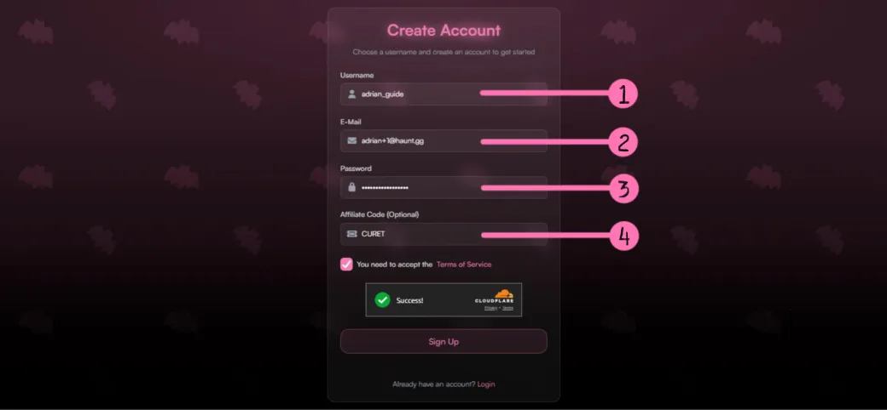
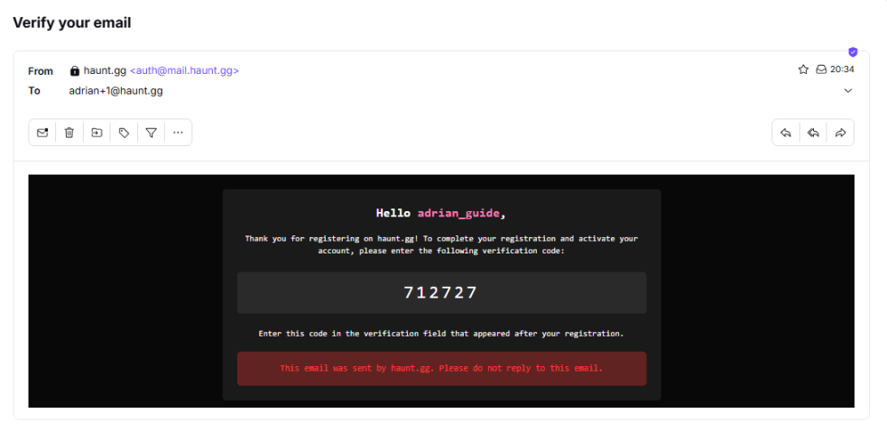
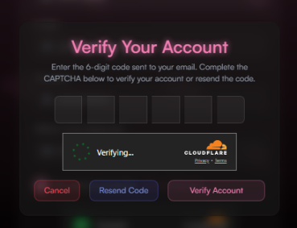
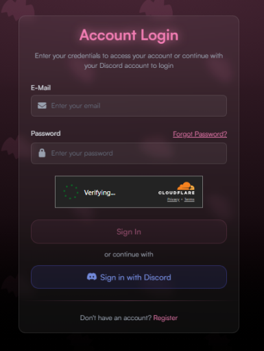
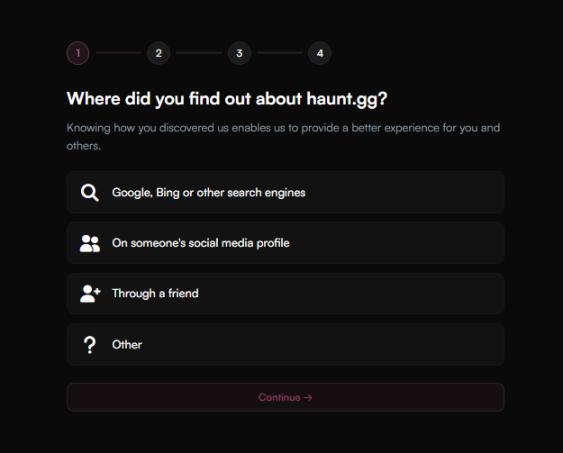
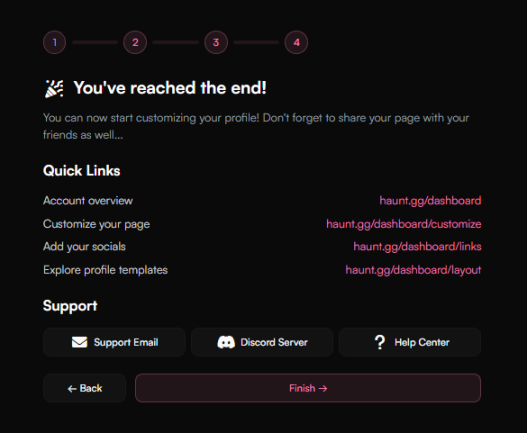

<Tabs>
  <Tab title="Get Started">
    <Info>To register an account on haunt.gg, open the [**register page**](https://haunt.gg/register).</Info>
  
  <Frame>
  
  </Frame>

  <Icon icon="circle-1" size="1.5em" /> Enter the username you want to claim  
  <Icon icon="circle-2" size="1.5em" /> Enter your email address  
  <Icon icon="circle-3" size="1.5em" /> Create a strong password to protect your account  
  <Icon icon="circle-4" size="1.5em" /> If you were referred by a user with an affiliate code, enter it here. Otherwise, leave it blank  
  
  ---

  ## Email Verification

  <Frame caption="A code will be sent to your email. Enter the 6-digit code in the field and click 'Verify Account'.">
  
  

  </Frame>

<Card title="Continue (Log In)" icon="arrow-right" href="/overview/register#log-in">
  ‎
</Card>
  </Tab>

  <Tab title="Log In">
  After completing registration, you will be redirected to the [**login page**](https://haunt.gg/login). Log in to your account.

  <Frame>
  
  </Frame>

  <Card title="Continue (Onboarding)" icon="arrow-right" href="/overview/register#onboarding">
  ‎
</Card>
  </Tab>

  <Tab title="Onboarding">
  After logging in, you will be asked a few questions about how you discovered haunt.gg and how you plan to use it.
  <Info>Your answers will not affect your experience using haunt.gg.</Info>

  <Frame>
  
  </Frame>

  <Card title="Continue (Done)" icon="arrow-right" href="/overview/register#done">
  ‎
</Card>
  </Tab>

  <Tab title="Done">
  <Frame caption="If you see this page, it means the registration process is complete.">
  
  </Frame>

<Card title="Customize your profile!" icon="arrow-right" href="/customization/customization">
  Start customizing your profile — thanks for choosing haunt.gg!
</Card>
  </Tab>
</Tabs>
